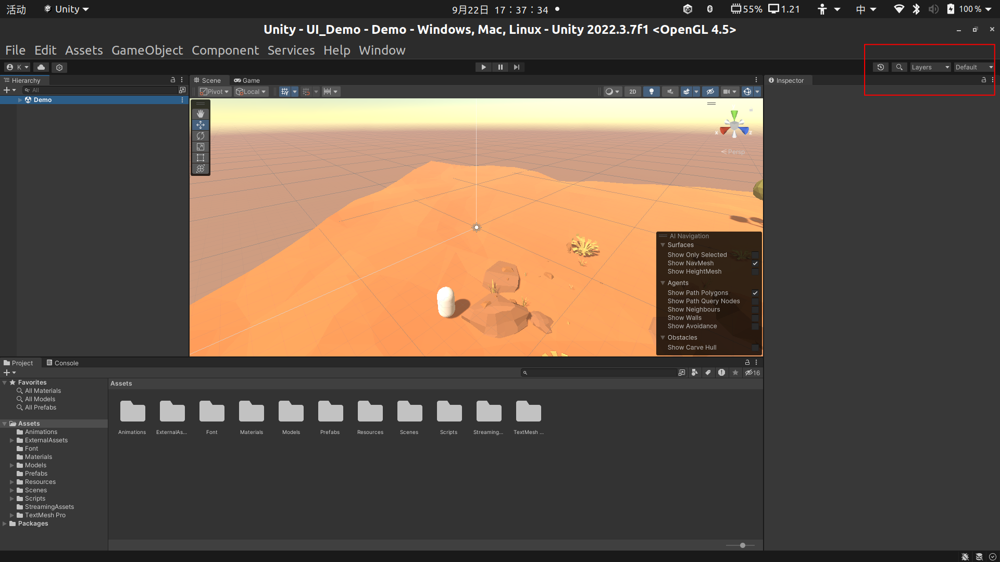
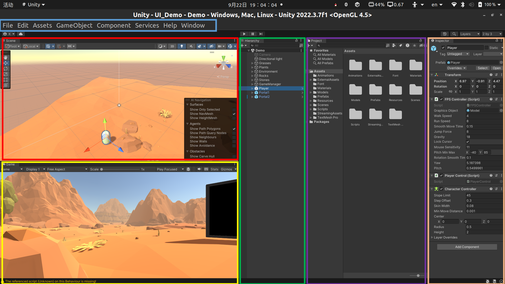
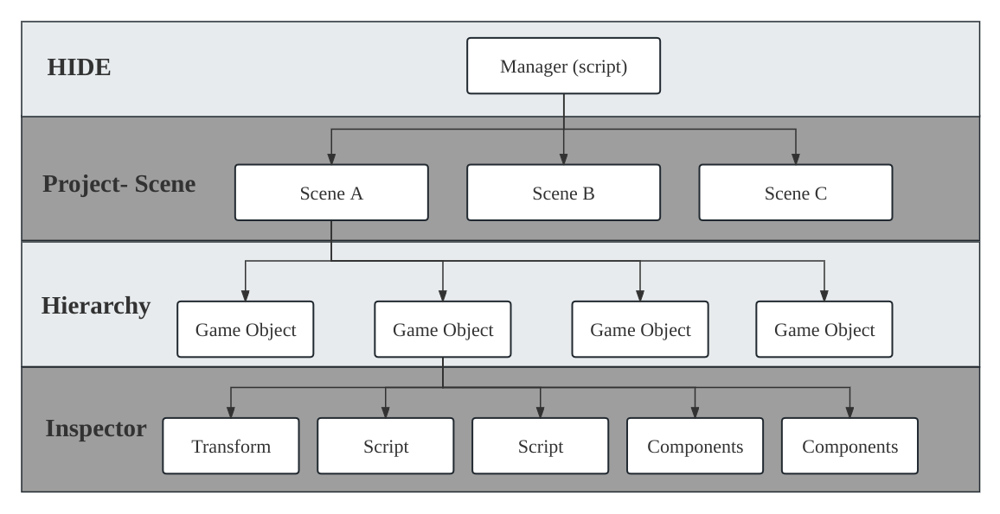
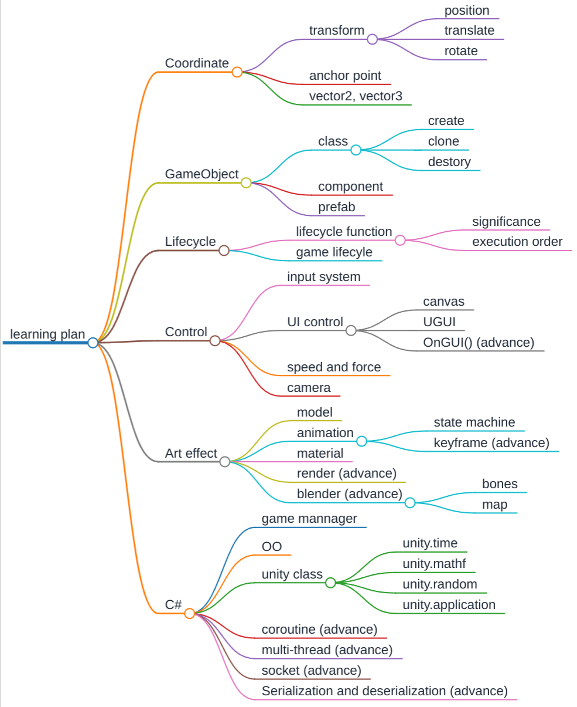
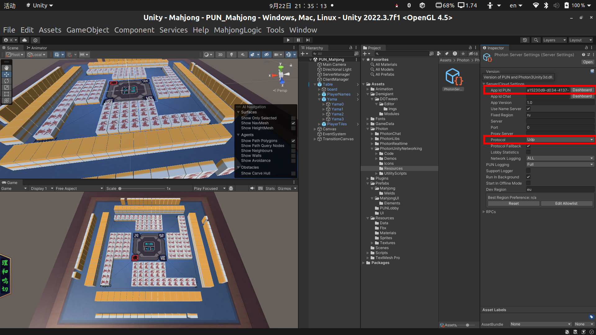
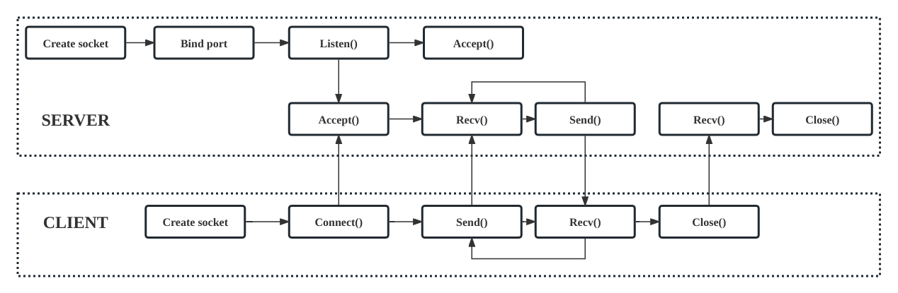

# Unity3D tutorial for beginner

This is a simple tutorial for unity 3D beginner. Provided by JiaZexuan, feel free to ask me anything in the appropriate manner.

## Introduction

[Unity](https://unity.com/) is a 2D & 3D game engine that has been around since 2005. Developed by Unity Technologies, it was made in order to provide more developers access to game development tools, which in those days was a novel venture. Over the course of its long life, the engine has changed and expanded dramatically, managing to keep up with the latest practices and technologies.

### Why Unity?

- Cross platform: Create on Windows, Linux, Mac, product used on PCs, consoles, smartphone, web, VR/AR, etc.
- Simple and intuitive interface: Visual script, visual interface.
- Comprehensive and simple scripting language: Use C# (a java-like language), unityscript (js for unity), lua, etc.

In addition, there are more game engines, such as Unreal, Godot, etc. But none of them are easier for beginners to make games than Unity.

### Composition

1. A game engine, that allow you to create, test and play 2D/3D games and experiences in various devices.

2. An editior, that combines design and user interface with graphics preview and playback controls.

3. A library, that encapsulates many commonly used methods.

### Environment setup

I assume that you have already registered a Unity account and obtained a license to use it. If you don't have one, search for it yourself.

#### Windows and MacOS

1. Install UnityHub
   
   ```shell
   https://public-cdn.cloud.unity3d.com/hub/prod/UnityHubSetup.exe
   ```

2. Install a LTS verison editor
   
   ```shell
   See "Installs" in UnityHub, and select a LTS version editor
   ```

#### Linux

1. Add public signing key
   
   ```shell
   wget -qO - https://hub.unity3d.com/linux/keys/public | gpg --dearmor | sudo tee /usr/share/keyrings/Unity_Technologies_ApS.gpg > /dev/null
   ```

2. Add UnityHub repository in `/etc/apt/sources.list.d`
   
   ```shell
   sudo sh -c 'echo "deb [signed-by=/usr/share/keyrings/Unity_Technologies_ApS.gpg] https://hub.unity3d.com/linux/repos/deb stable main" > /etc/apt/sources.list.d/unityhub.list'
   ```

3. Update package cache and install
   
   ```shell
   sudo apt update
   sudo apt-get install unityhub
   ```

4. Install dotnet SDK
   
   ```shell
   # download script
   wget https://dot.net/v1/dotnet-install.sh -O dotnet-install.sh
   # update permission
   sudo chmod +x ./dotnet-install.sh
   # install
   ./dotnet-install.sh --version latest
   ```

5. Update environment variable, insert the follows into ``~/.bashrc``
   
   ```shell
   export DOTNET_ROOT=$HOME/.dotnet
   export PATH=$PATH:$HOME/.dotnet:$HOME/.dotnet/tools
   ```

## Start Here

### Connect Unity with IDE

I suggest you to use Visual Studio (only for windows) or Jetbrains Rider as your unity IDE. About how to install it, please search yourself. 

```shell
Edit->Preferences->External Tools->External Script Editor
```

### Layout and panel

In initial state, you will see the interface like this:



I strongly suggest you to set the layout as "2by3" mode, just presh the button rightest of red block and choose "2by3". Then the interface will be like this:



The editor interface is divided into 6 parts (1 bar + 5 panel):

- Blue: **Editor bar**, just like other software you usually use.

- Red: **Scene panel**, used to display the hierarchical structure of the current scene and the specific performance of objects in the world.

- Yellow: **Game panel**, used to preview the running effect of the game in the Unity editor.

- Green: **Hierarchy panel**, showing the hierarchical structure of all objects in the scene.

- Purple: **Project panel**, showing all resource files in the Unity project, including scenes, scripts, materials, textures, etc.

- Orange: **Inspector panel**, used to view and edit the properties and components of the selected object, add, configure and customize the components of the object.

### Special folder

- **Assets**: The Assets folder is the main folder that contains the Assets used by a Unity project. Most API functions assume that everything is located in the Assets folder and don’t require it to be mentioned explicitly.

- **Editor**: Editor scripts add functionality to Unity during development but aren’t available in builds at runtime. Scripts in an Editor folder run as Editor scripts, not runtime scripts.

- **Resources**: You can load Assets on-demand from a script instead of creating instances of Assets in a Scene for use in gameplay. You can use ``Resources.Load(string objectName)`` to load objects. 

- **Scenes**: Store the scenarios of your project.

- **Scripts**: Store the script files you wrote.

### Structure , Unity and C#

This section is some theoretical knowledge of Unity and C#. It may be relatively abstract, but it is very helpful for completing a complete project.

#### Structure

Simply, the structures of a unity game are like this, and you can find them on the specific plane shown on the left.



#### Unity and C#

1. **C#**
   
   As a compiled language (statically typed language), C# code needs to be compiled by a compiler before running and generate an executable local code file (usually an .exe or .dll file).

2. **Lifecycle method**
   
   The Predetermined Order to execute a number of event functions from top to bottom in Unity Script is called Unity Life Cycle. You could find more details at [Understanding the Unity life cycle - Unity Virtual Reality Projects - Second Edition [Book]](https://www.oreilly.com/library/view/unity-virtual-reality/9781788478809/6e8a05d0-626a-4dc1-bacb-e97de9af2be7.xhtml).

3. **Thread**
   
   There is and only main thread can get and control game object of unity game, use multi-thread to control a game object is impossible. It is hard to use multi-thread to render. Almost all operations about gameobject are high-cost, such as ``GameObject.Find()`` ``GameObject.GetComponent()``, ``GameObject.AddComponent()``, ``GameObject.setActive()``, call these functions as little as possible.

4. **Coroutine** (advance)
   
   Since Unity can only operate GameObject in the main thread, coroutines are used to achieve an effect similar to multi-threading. It should be noted that coroutine is not multi-threaded. We use coroutines to simply write a timer to save resources.
   
   ```cs
   public class CoroutineTimer: MonoBehaviour
   {
       void Start()
       {
           StartCoroutine(Timer(1));
       }
   
       IEnumerator Timer(float second)
       {
           int cnt = 0;
           while(true)
           {
               // wait for "second" time, then countine
               yield return new WaitForSeconds(second);
               cnt++;
               Debug.Log(cnt);
               gameObject.GetComponent<TextMeshPro>().text = cnt.ToString();
           }
           // return the conroutine
           yield break;
       }
   
       void StopTimer()
       {
           // stop all running coroutine named "Timer"
           StopCoroutine("Timer");
       }
   }
   ```
   
   You may have noticed that, the nature of coroutine is an asynchronous method, implemented using iterators. Therefore, when using a coroutine, there'll be GC. It is best not to call one coroutine in multiple places.

## Learning Plan

At this step, you must have some basic understanding of Unity development. Due to limited space, we will not describe too much details of the learning plan.

AS the version I provided before was written haphazardly, when I was in the early stages of learning. It may be confusing and complicated, and many parts of it are not necessary to be too in-depth. A simplified version is provided here.



## Tips-network service

This section is an introduction and suggestions for those who want to implement network services.

### Transport Protocol

From bottom (the link) to top (the user application), these are the physical, data link, net- work, transport, and application layers.

Here, in game development, we just need to foucs on TRANSPORT LAYER and the protocol.

1. TCP (Transmission Control Protocol): achieves reliable network communication through technologies such as "three handshakes, four waves" and checksum, but the speed is slow.

2. UDP (User Datagram Protocol): does not check, is faster, and is commonly used in the gaming field.

### Network framework

1. [Photon](https://www.photonengine.com/zh-cn)
   
   - Register and get a app id
   
   - Install plugin "PUN 2" in unity official asset store, and load in your project
   
   - Set your appid here
   
   ```shell
   Window-> Photon Unity Networking-> Highlight server setting
   ```
   
   
   
   - A demo using photon: [Tanknarok | Photon Engine](https://doc.photonengine.com/zh-cn/fusion/current/game-samples/fusion-tanknarok)

2. [C# Socket](https://learn.microsoft.com/en-us/dotnet/api/system.net.sockets.socket?view=net-7.0)
   
   
   
   The Socket abstraction layer exists between the application layer (user process) and the transport layer (TCP and UDP). It is a set of interfaces that hide the complex TCP/IP protocol family behind the Socket interface in the design pattern.
